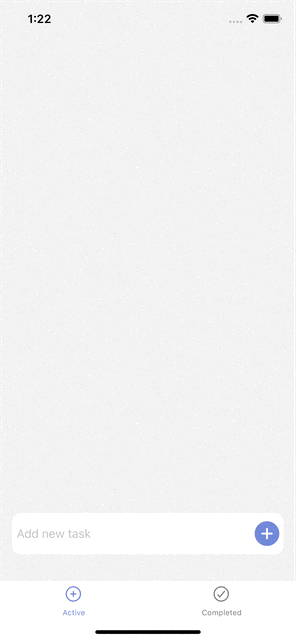

## How to run
1. Clone repo onto your local device
2. Navigate to the local repository
3. Run `npm install` or `yarn` command to install dependencies.
4. Run the app for android by using the command `npx react-native run-android` and for ios first run `cd ios;pod install;cd ..`and then `npx react-native run-ios`
  
## App Demo

## Future Improvements
- Scaled font and components
- Better color scheme
- More features for better UX
- Potential Features:  
  - Description for the tasks
  - last date of modification shown for each tasks
  - use firebase to authenticate users and backup their data
- Better edge cases handling